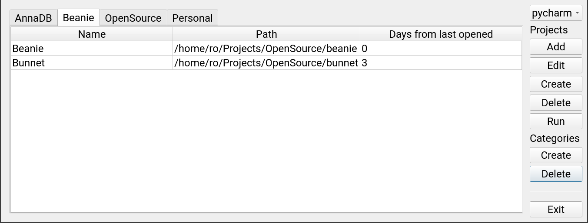

# Code Runner

A simple and intuitive desktop application to manage your coding projects, built with Python and Qt (using PySide6).

## Features

* Organize projects into categories.
* Quickly access project information, such as project name, path, and last opened date.
* Easily add, create, delete, and run projects with built-in buttons.
* Customize your project's attributes like name, path, and category.
* Choose between different IDEs, such as PyCharm and Visual Studio Code.
* Tab-based navigation for easy access to different project categories.