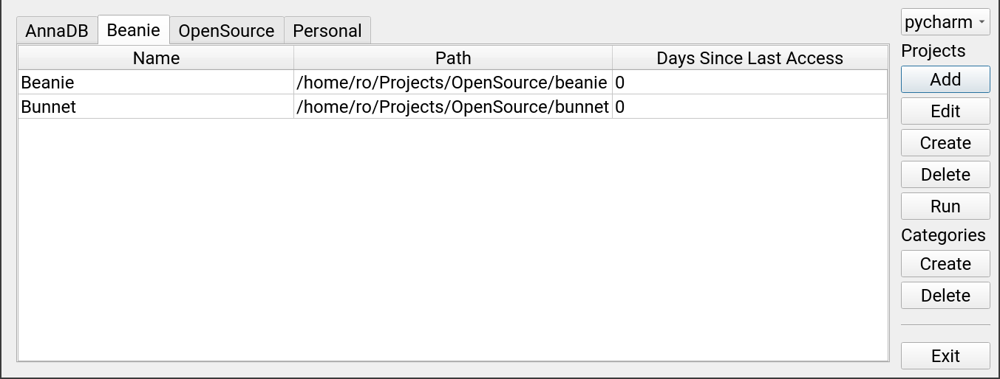

# Code Compass



A simple and intuitive desktop application to manage your coding projects, built with Python and Qt (using PySide6).

## Features

* Organize projects into categories.
* Quickly access project information, such as project name, path, and last opened date.
* Easily add, create, delete, and run projects with built-in buttons.
* Customize your project's attributes like name, path, and category.
* Choose between different IDEs, such as PyCharm and Visual Studio Code.
* Tab-based navigation for easy access to different project categories.

## Installation

```shell
pip install code-compass
```

## Usage

```shell
code-compass
```

## Configuration

Code Compass uses a configuration file to store your preferences. The configuration file is located at `~/.config/code_compass/config.yaml`.

### Example

```yaml

# IDE commands to run when clicking the "Run" button.
ide_commands:
  - pycharm
  - code

# Default path to start browsing when adding or creating a new project.
projects_path: /home/username/Projects

# Cookiecutter template to use when creating a new project.
cookiecutter: https://github.com/roman-right/py-template

```

## Contributing

Pull requests are welcome. For major changes, please open an issue first to discuss what you would like to change.
